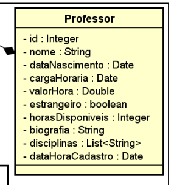

# Projeto JDBC
## :dart: Objetivo
Criar um CRUD que possibilite registrar um professor no Banco de Dados, deletar registros, realizar alterações e listá-los a partir de uma requisição específica.  

  

  
## :computer: Tecnologias
- Java
- Maven
- Postgresql
## :gear: Configurações do Ambiente
- crie um Banco de Dados Postgreesql
- criar arquivo de nome `.env` na raíz do projeto, com os dados do seu Banco de Dados, conforme modelo a seguir

  

## :man_technologist: Integrantes
- Aécio Guterres
- Arthur Barbosa
- Gustavo Ferreira
- João Gabriel Wolter
- Paulo Granthon
- Tânia Cruz

